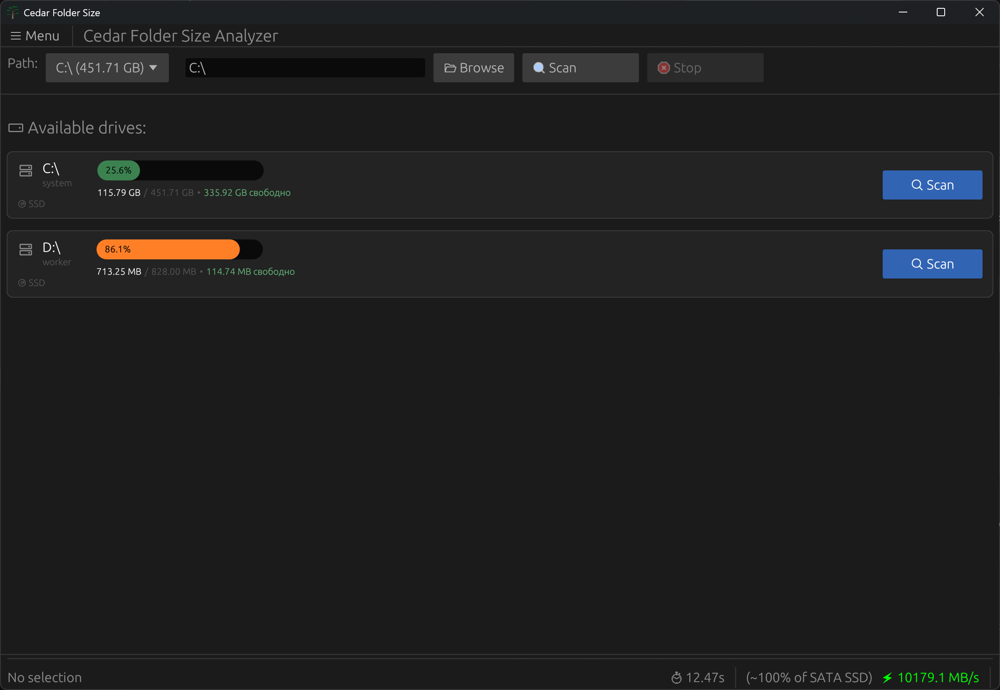
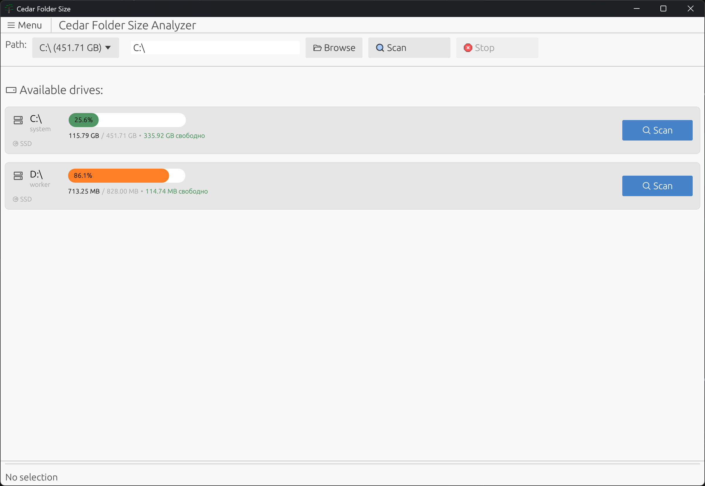
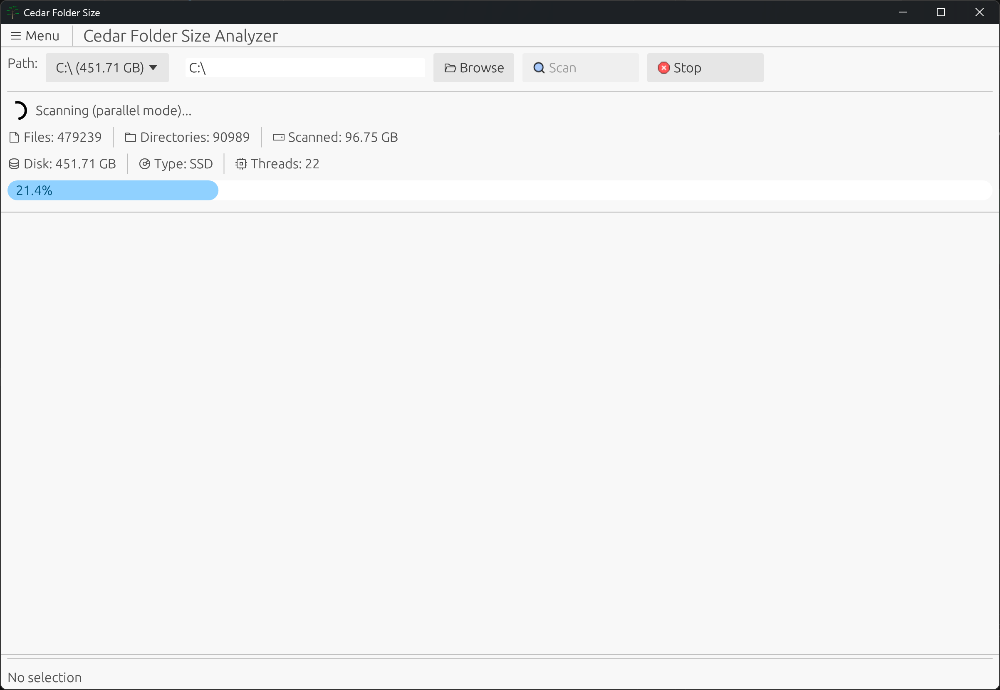
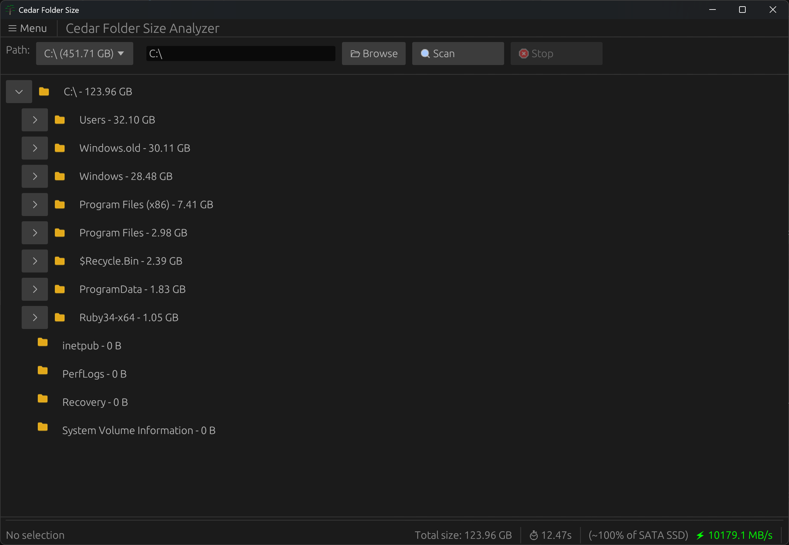
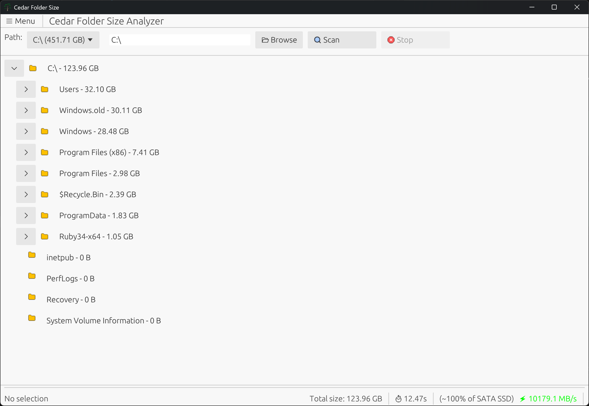

# Cedar Folder Size Analyzer 🌲

<p align="center">
  
</p>

Анализатор размеров папок и дисков для Windows, написанный на Rust. Удобный инструмент для визуализации использования дискового пространства с древовидной структурой.





## Возможности

- 📊 Сканирование дисков и папок
- 🌲 Древовидное отображение структуры директорий (файлы и папки)
- 📏 Отображение размеров папок и файлов
- 🔍 Сортировка по размеру (от большего к меньшему)
- 🖥️ Поддержка всех доступных дисков Windows
- 💾 Отображение размера и типа диска (SSD/HDD)
- ⚡ Адаптивная многопоточность (SSD - параллельно, HDD - однопоточно)
- ⏹️ Возможность остановки сканирования в любой момент
- 📈 Детальный прогресс-бар с информацией о процессе
- 🚀 Анализ скорости сканирования и эффективности
- 🌙 Тёмная и светлая темы (автоопределение системной темы)
- 🌍 Мультиязычность (6 языков: EN, RU, DE, ZH, ES, FR)
- 💾 Автосохранение настроек (тема, язык, последний путь)
- 🗑️ Безопасное удаление файлов и папок в корзину Windows
- 📂 Открытие папок в проводнике
- 📋 Копирование путей в буфер обмена
- 🎨 Современный GUI на базе egui с иконками Phosphor

## Установка и запуск

### Вариант 1: Установка через MSI (рекомендуется)

1. Скачайте последнюю версию `cedar-folder-size-analyzer-<version>-x86_64.msi` из раздела [Releases](https://github.com/OrelSokolov/cedar-folder-size-analyzer/releases)
2. Запустите установщик и следуйте инструкциям
3. Приложение будет установлено в `C:\Program Files\Cedar\`
4. По желанию можно добавить в PATH для запуска из командной строки

> **Примечание:** Релизы собираются автоматически через GitHub Actions при создании тегов. См. [GITHUB_CI.md](GITHUB_CI.md) для деталей.

### Вариант 2: Сборка из исходников

**Требования:**
- Rust 1.70 или выше
- Windows 10/11

```bash
# Клонируйте репозиторий
git clone https://github.com/yourusername/cedar-folder-size-analyzer.git
cd cedar-folder-size-analyzer

# Соберите проект
cargo build --release

# Запустите приложение
cargo run --release
```

### Вариант 3: Создание MSI установщика

**Требования:**
- Rust 1.70 или выше
- Windows 10/11
- WiX Toolset (включён в проект в папке `wix-tools/`)

**Шаги сборки:**

```bash
# 1. Соберите релизную версию приложения
cargo build --release

# 2. Скомпилируйте WiX файл в объектный файл
.\wix-tools\candle.exe -nologo -arch x64 -ext WixUIExtension wix\main.wxs `
  "-dCargoTargetBinDir=target\release" `
  "-dVersion=0.1.0" `
  -out target\wix\main.wixobj

# 3. Создайте MSI установщик
.\wix-tools\light.exe -nologo -ext WixUIExtension -ext WixUtilExtension `
  -out target\wix\cedar-folder-size-analyzer-0.1.0-x86_64.msi `
  target\wix\main.wixobj
```

Готовый MSI установщик будет находиться в `target\wix\cedar-folder-size-analyzer-0.1.0-x86_64.msi`

> **Примечание:** Если вы изменили `src/icons/cedar.svg`, запустите конвертер иконок для обновления `wix/Product.ico`:
> ```bash
> cd icon_converter
> cargo run --release
> cd ..
> ```

**Возможности установщика:**
- ✅ Установка в `C:\Program Files\Cedar\`
- ✅ Создание ярлыка в меню "Пуск"
- ✅ Опциональный ярлык на рабочем столе
- ✅ Опциональное добавление в PATH
- ✅ Встроенная иконка приложения
- ✅ Простая деинсталляция через "Программы и компоненты"

## Использование

### 1. **Выбор пути для сканирования:**
   - Выберите диск из выпадающего списка (отображается размер и тип)
   - Или введите путь вручную
   - Или используйте кнопку "📂 Browse" для выбора папки

### 2. **Запуск сканирования:**
   - Нажмите кнопку "🔍 Scan"
   - Программа автоматически определит тип диска и выберет оптимальный режим:
     - **SSD** → Многопоточное сканирование (быстрее)
     - **HDD** → Однопоточное сканирование (оптимально для механических дисков)
   - Наблюдайте за прогрессом в реальном времени:
     - Количество просканированных файлов и директорий
     - Текущий обрабатываемый путь
     - Общий размер найденных данных
     - Тип диска и количество потоков
   - При необходимости нажмите "⏹ Stop" для прерывания сканирования



### 3. **Навигация по дереву:**
   - Нажмите на кнопку `+` для раскрытия или `−` для свертывания папок
   - **Одиночный клик** на папку для выбора
   - **Двойной клик** на папку для раскрытия/свертывания
   - **Правый клик** для контекстного меню:
     - 🗑 Удалить в корзину (безопасное удаление)
     - 📂 Открыть в проводнике
     - 📋 Копировать путь
   - Наведите курсор на элемент для просмотра полного пути





### 4. **Интерпретация результатов:**
   - Папки отображаются с иконкой 📁 (всегда, даже если пустые)
   - Файлы отображаются с иконкой 📄
   - Размеры показываются в удобочитаемом формате (KB, MB, GB, TB)
   - Элементы отсортированы по размеру (от большего к меньшему)
   - Папки с содержимым автоматически раскрываются
   - Внизу отображается:
     - Общий размер просканированных данных
     - Время сканирования
     - Скорость сканирования (⚡ в MB/s)

### 5. **Настройки:**
   - **☰ Меню** → **Сменить тему** (🌙 тёмная / ☀ светлая)
   - **☰ Меню** → **Язык** (English, Русский, Deutsch, 中文, Español, Français)
   - **☰ Меню** → **О программе** (информация о приложении)
   - Настройки сохраняются автоматически

## Технологии

- **egui** - кросс-платформенный GUI фреймворк
- **rayon** - параллельная обработка данных
- **sysinfo** - получение информации о дисках (размер, тип SSD/HDD)
- **rfd** - нативные диалоги выбора файлов

## Структура проекта

```
cedar-folder-size-analyzer/
├── src/
│   ├── main.rs          # Основной код приложения
│   ├── i18n.rs          # Система интернационализации
│   └── icons/           # SVG иконки (cedar, folder, file, search, stop)
├── languages/           # Файлы переводов (en, ru, de, zh, es, fr)
├── wix/                 # Файлы для создания MSI установщика
│   ├── main.wxs         # Конфигурация WiX
│   ├── License.rtf      # Лицензионное соглашение
│   └── Product.ico      # Иконка приложения (генерируется из cedar.svg)
├── wix-tools/           # WiX Toolset (candle.exe, light.exe)
├── icon_converter/      # Утилита для конвертации SVG в ICO
├── build.rs             # Скрипт сборки (встраивание иконки в EXE)
├── Cargo.toml           # Зависимости и настройки проекта
└── README.md            # Документация
```

## 🔄 CI/CD и релизы

Проект использует GitHub Actions для автоматической сборки релизов:

- ✅ Автоматическая сборка при создании тегов
- ✅ MSI установщик
- ✅ ZIP архив с исполняемым файлом
- ✅ Автоматическое создание GitHub Releases

**Быстрый старт - создание релиза:**

```powershell
# Автоматически (рекомендуется)
.\scripts\create-release.ps1 -Version 0.2.0

# Или вручную
git tag -a v0.2.0 -m "Release version 0.2.0"
git push origin v0.2.0
```

GitHub Actions автоматически соберёт и опубликует релиз с артефактами.

**Документация:**
- 🚀 [QUICKSTART.md](QUICKSTART.md) - Быстрый старт
- 📖 [GITHUB_CI.md](GITHUB_CI.md) - Подробная документация CI/CD

## Возможности для развития

- [ ] Визуализация в виде круговой диаграммы (treemap)
- [ ] Экспорт результатов в файл
- [ ] Фильтрация по типам файлов
- [ ] История сканирований
- [ ] Поиск по дереву
- [ ] Настройки (исключение папок, лимиты глубины)
- [ ] Портирование на Linux и macOS

## Лицензия

Freeware - бесплатное программное обеспечение для личного и коммерческого использования.

## Автор

Oleg Orlov (orelcokolov@gmail.com) - 2025


